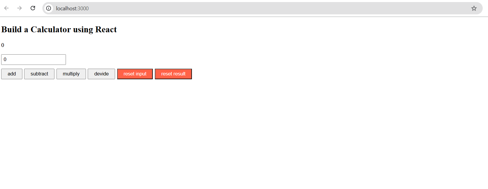

# React Calculator App

A simple calculator application built with *React*.  
This project demonstrates basic React concepts such as *components, **state management (useState), and **event handling*.

---

## 🚀 Features
- Perform basic arithmetic operations:
  - ➕ Addition  
  - ➖ Subtraction  
  - ✖ Multiplication  
  - ➗ Division  
- Reset input field  
- Reset the result  

---

## 🛠 Tech Stack
- *React* (Frontend library)
- *JavaScript (ES6+)*
- *CSS* for styling

---

## 📸 Preview
  
*(Take a screenshot of your app, save it as screenshot.png in the root folder, and it will appear here.)*

---

## ⚡ Getting Started

### 1. Clone the Repository
```bash
git clone https://github.com/<your-username>/<repo-name>.git
cd <repo-name>
npm install
npm start

This app will run on http://localhost:3000

